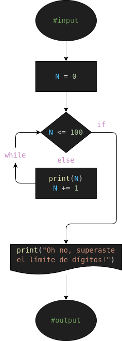

# Comando "while"
repositorio sencillo para explicar como usar el comando while en python

### Para que sirve?
- El comando while se usa para generar una respuesta infinitamente hasta que la condicion determinada sea falsa

### Diseño

